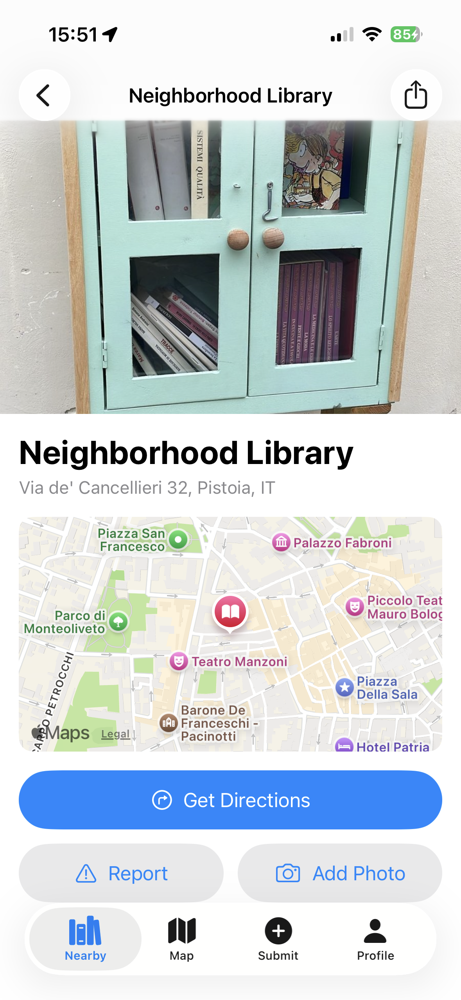

# Book Corners for iOS

Book Corners is a community directory of book-sharing libraries — those little shelves, boxes, and cabinets where neighbours leave books for each other. This is the iOS client for [bookcorners.org](https://www.bookcorners.org).

## Features

- Browse nearby book-sharing libraries sorted by distance
- Explore libraries on an interactive map
- View library details with photos, address, and a mini map
- Get directions via Apple Maps or Google Maps
- Submit new libraries with photo and GPS location
- Add photos to existing libraries
- Report issues on library listings
- Sign in with email, Apple, or Google

  
  &nbsp;&nbsp;
  

## Requirements

- iOS 26.0+
- Xcode 26+
- Swift 6.2

## Getting Started

1. Clone the repository
2. Open `BookCorners/BookCorners.xcodeproj` in Xcode
3. Select a simulator or device and run (`Cmd+R`)

## Contributing

Contributions are welcome! If you'd like to help:

1. Fork the repository
2. Create a feature branch (`git checkout -b feature/my-feature`)
3. Make your changes and commit (`git commit -m 'Add my feature'`)
4. Push to your fork (`git push origin feature/my-feature`)
5. Open a Pull Request

Please keep changes small and focused. If you're planning something larger, open an issue first to discuss the approach.

## License

This project is licensed under the MIT License — see the [LICENSE](LICENSE) file for details.
